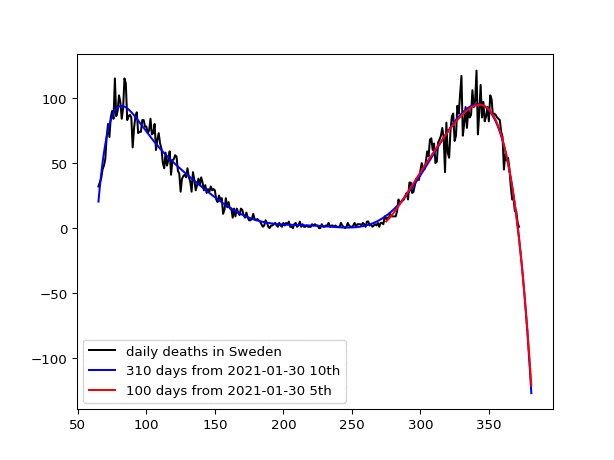

# sweden

The latest data should be downloaded from:

https://raw.githubusercontent.com/owid/covid-19-data/master/public/data/jhu/new_deaths.csv

This site is stopped: 
https://covid.ourworldindata.org/data/ecdc/new_deaths.csv
 
 Prediction is based on the curve fitting with 10th degree polinomial: np.polyfit(x[valid],y[valid],10).
 
 Blue line is the predicted curve using the last 280 days from Jan.22 in 2020. Red line is changing the size of days from 100 to 280 days from Dec.31 in 2020. Black line shows the number of daily deaths due to the covid-19 from Jan.22 to Dec.31 in 2020.
 
 
 
 
 # Exercises for students
 <pre>
 You should code a Python program using numpy.polyfit function as shown above picture.
 Hint: curve fitting with 10th degree polinomial: np.polyfit(x[valid],y[valid],10)
 </pre>
 
 sweden.tar was encrypted by: 
 
 tar cvf - swedendaily.py |openssl enc -e -aes256 -out sweden.tar
 
 In order to expand sweden.tar, use the following command:
 
 openssl enc -d -aes256 -in sweden.tar|tar xv
 
 Of course, you need a password!
 
 
